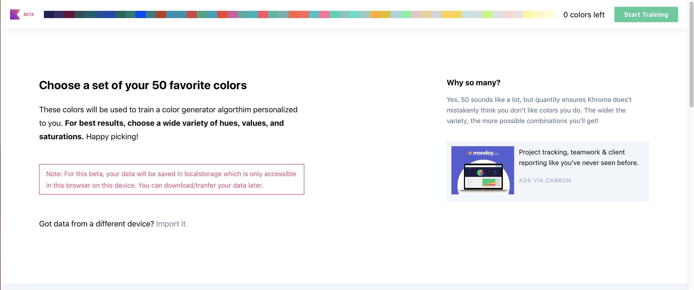
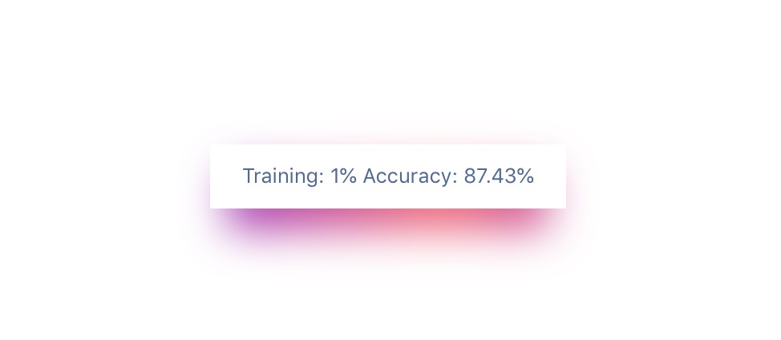
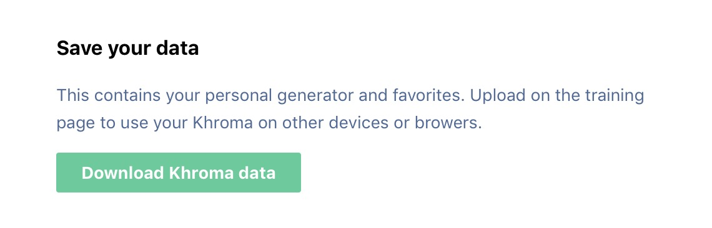
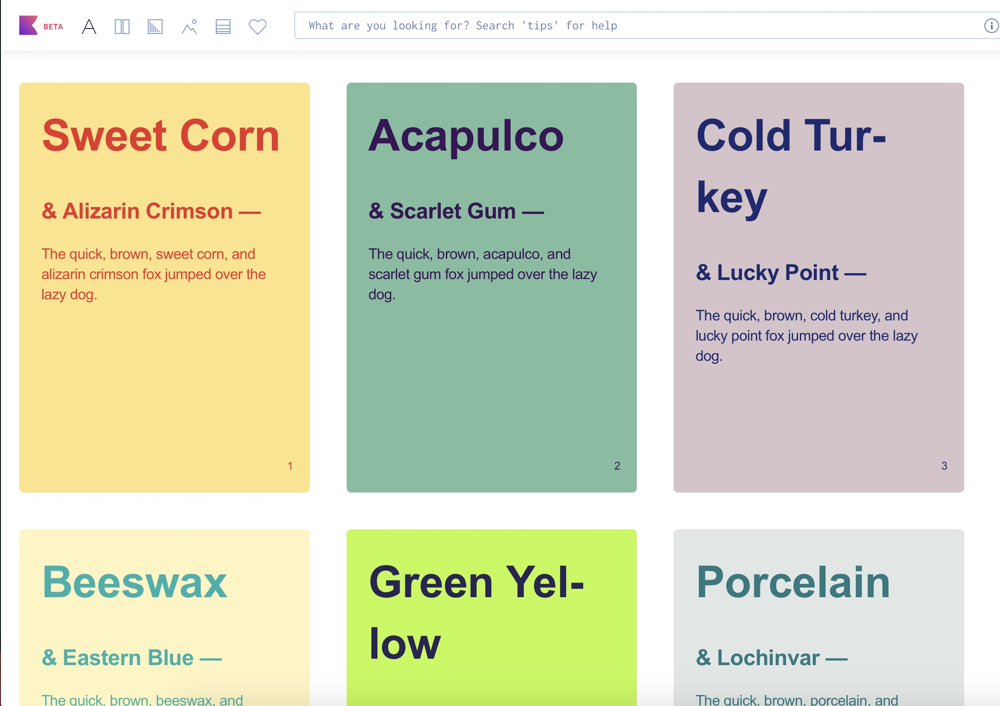
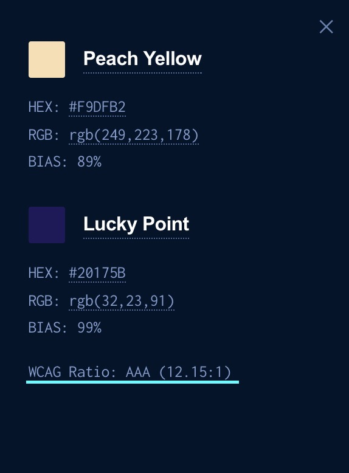

[TOC]
### 配色问题
对于设计师来说，色彩的搭配问题是一个经常会遇到，也经常会头疼的问题（至少对我来说有这样的体会）。有时候为了搭配好的配色，需要不断的去调整，测试，甚至于纠结，到最后也不见得满意。
AI目前似乎在各个领域都有应用，自然在解决配色问题的时候也能提供不少的帮助。不见得是完全决定设计师的配色方案，但是辅助设计师作出决策还是可行的。
何为辅助？
利用AI学习设计师个人喜好的颜色，然后给出**无穷个**配色方案，设计师再从中选择出自己觉得满意的搭配进行微调和尝试。
可以看到其实AI在其中扮演的只是一个提供备选配色方案的角色，并没有剥夺设计师的选择和创造。只是减少了设计师在进行颜色搭配的时候的纠结时间。下面来看一个AI配色网站，体会一下。

### khroma是什么
[khroma在这里](http://khroma.co)
官方的site标语：

> The AI color tool for designers

笔者的理解是：一个用AI技术辅助设计师进行配色的网站。
其实类似的网站不止这一个，有很多其他的，不过我只体验了这一个，觉得很不错，也就没有体验其他的网站了。

### khroma配色体验
#### 1. 选取喜好色

官方告诉说，至少凭借你的喜好选出50种颜色，最好是**各个色相**的都有，这样搭配出来的方案更加的合理和多样。

#### 2. 上传并训练(train)

这一步交给网站的服务器去完成就可以了，就是需要耐心等待，因为训练和数据传输都需要花费不少的时间。

#### 3. 保存训练数据
由于网站没有账户模块，所以训练好的数据是本地缓存到浏览器的，很容易丢失。但是网站提供的一个**data下载**功能。下载下来的文件是一个`json`格式的文件，只要你保存了这个文件，你的颜色喜好数据就可以在不同的电脑，不同的浏览器之间传输了（虽然感觉有点儿原始，不过没有账户就是这样）。

#### 4. 选取配色方案

这里我根据自己的喜好选取了两种配色（用时不到1min）。并且自己作图进行了尝试，发现效果都还不错。

效果图：

但是，并非所有的配色都很合理，实际上我们在选择文字/背景的配色组合的时候需要注意到一个参数**WCAG**
这是wiki的定义：
> WCAG Ratio:WCAG 2 level AA requires a contrast ratio of at least 4.5:1 for normal text and 3:1 for large text. Level AAA requires a contrast ratio of at least 7:1 for normal text and 4.5:1 for large text.

根据以上定义：
普通文字需要WCAG > 4.5,大标题文字WCAG > 3.可以达到AA，这是一个相对舒服的文字/背景对比。当然长时间的阅读则需要达到AAA标准才行。

khroma，在每一种配色卡片上除了给出每种颜色的基本参数，还给出了配色的WCAG值

这样我们在生成的配色中就能更有依据选择出能够利用的好的配色。

### 猜想
AI在设计领域的应用远不止配色，这一个方面，它拥有更加广泛的应用。在笔者看到的有关AI & design 的文章当中有很多都提到了**AI辅助设计**的概念。的确，目前的AI的设计能力、创造力（甚至于AI有没有创造力还没定论）等方面还远远不及人类设计师。但是作为人类设计师的辅助，它的确是一个不错的靠谱的帮手。