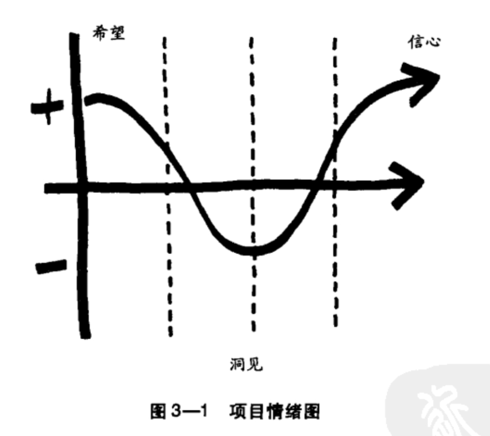
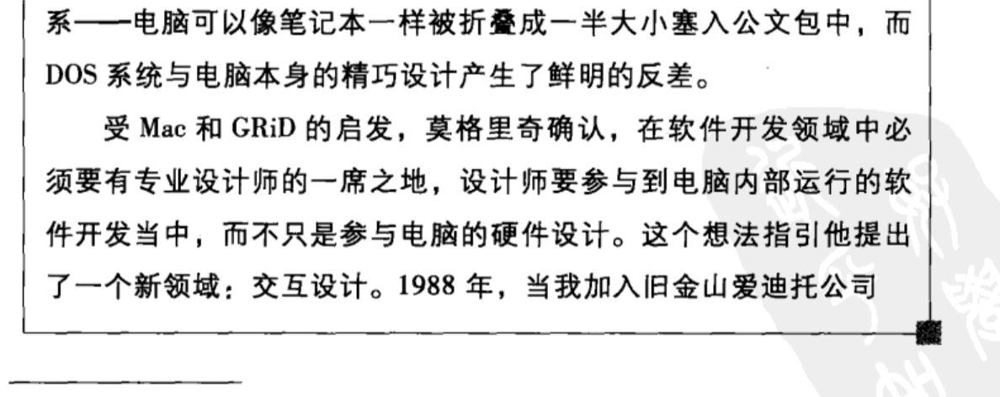

**Content**
[TOC]

#### 第一 | 二章
- 设计思维
- 做一名设计师 像一名设计师一样思考
- 设计可能不能仅仅交给设计师去做
- 设计的产物不一定是实际的产物，可能是新型的流程、服务、互动、娱乐、交流与合作方式
- 设计师的标志，正是愿意接受约束
    - 可行性：在可预见的未来，有可能实现的功能
    - 延续性：有可能成为可持续商业模式的一部分
    - 需求性：对人们来说是有意义的
- 强调人的基本需求，是推动设计思维摆脱现状的动力
- 创意阶段，需要小团队去建立框架
- 去中心化的小团队，共同解决问题
- 将素材暴露在可见范围内，提升创意的触发概率
- 等级/讲效率 -> 冒险/探索 是挑战
- 新一代设计师，需要mutiple tasking 的能力
- 失败得愈多愈早，成功将愈快来临
- 有约束，才有设计。严苛的约束，造就卓越的设计
- 试错的重要性

#### 第三章 | 思维矩阵——让思维过程变得清晰
- 洞察力：
    - 从用户的行为出发，洞察出真正的需求
- 观察
    - 关注人们没有做的，倾听人们没有说出来的
    - 想要得到洞察，需要从边缘情况考虑
- 换位思考
    - 洞察会带来新的洞察
    - 总体大于各部分相加之和
- 合作式设计，让用户参与到设计中来
- 做设计不能总依靠灵感，因为它可能是随机的。而应该遵循某些确定的技巧。“机会总是眷顾那些有准备的头脑”
- tips：
    - 洞察力是设计的关键来源之一
    - 设计到设计思维的演化
    - 设计 - 洞察 - 产品/服务
    - 帮助人们表达他们自己可能都不知道的需求
- 三个相互重叠的构思空间：灵感 - 构思 - 实施

汇聚与发散：
-  集体思维倾向于“汇聚”
- “汇聚”思维不擅长探索新的思路，“发散”思维擅长
分析与综合：
- 数据本身不会说话
用实验的精神去设计：
- 必须给创造性团队时间、空间、机会去犯错
- 用高达20%的时间进行个人的项目实验
- tips：
    - 不应该考虑新想法的提出者，应该着重于想法本身
    - 明确说明核心目标
    - 应该支持那些引发争论的想法
- 犯错的是凡人，宽恕的是圣人
让组织乐观起来：
- 某些人会得到排挤，但是他们本身并没有什么错，这会导致组织的根基出现问题
- 想法得到了正确的明智的评判才会增强创意者的信心，而非“想法生而平等”
- 乐观精神需要信心，而信心是建立在信任之上的
- 
头脑风暴法：
- 头脑风暴基于相互之间的信任
- 高效率的头脑风暴是基于相互关联的连续想法
发挥视觉思维的作用：
- 画图可以在快速的同时准确的表达我们的想法
- 视觉架构工具（思维导图、2*2矩阵……）
- 达芬奇之所以是天才，是因为他能将自己想到的东西完全的通过画笔描绘出来

小小便利贴中的大创新：
- 蝴蝶测试
- DDL is important
- 设计思维是最终整合思维的能力

#### 第四章 | 用手思考 —— 模型的力量

- 模型建立适可而止（不必过于精细），能推动想法前进即可
- 模型不仅仅是包含实物，也包括哪些简单而粗糙的研究
- 模型是赋予想法具体的外观，以便于制作下一代更精密的模型

#### 第五章 | 回到表面—设计用户体验

- User experience is important

#### 第六章 | 把你的想法传播出去——故事的影响力

- 讲个好故事
- 这不就是早期的UI/UX么！

- 交互设计是关于时间流动的设计
- 基于时间的叙述技巧已经进入设计的每个领域
- 交互设计应该放宽限制，而不是一味的追求规范的文档，被约束！
- 竞争最终会有一个人胜出，整体而言，每个人都获胜了——竞争的意义
- 信息量爆炸是广告宣传效益降低的原因之一
- 设计思维走出设计工作室，进入其他领域也可以解决更大的问题

#### 第七章 | 把设计运用到组织中——授人以渔
（暂时觉得用不到，就没有继续总结了）

