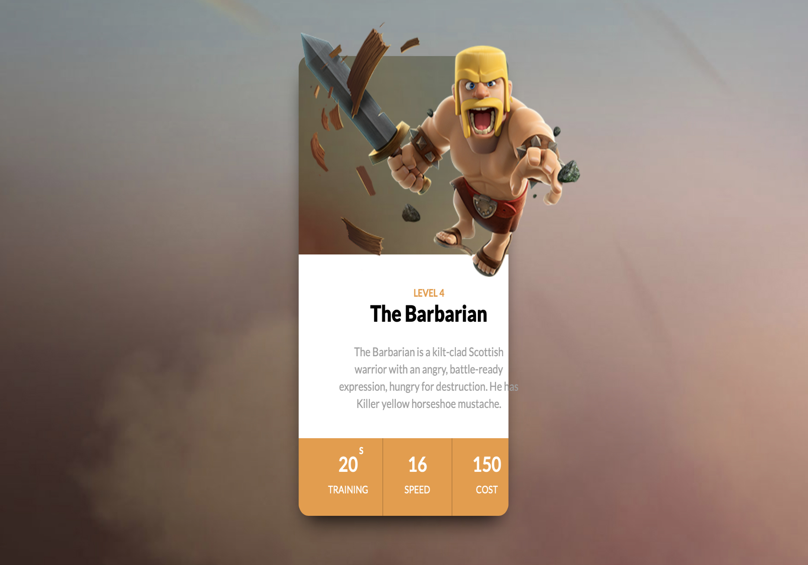
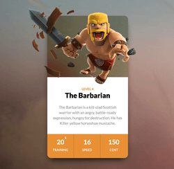

`css3` 对动画效果的支持，有时候总是那么让人着迷，相比于正真的动画制作css动画又显得简陋，但是有时候它表现出来的效果却又能让人感到惊艳。

有时候用简短的几行css便能表达出很好的效果。这里主要谈论`tranform`制作的一个**3D Flip**的一个效果。

*（下面的样式代码使用的是sass预编译语言。）*


#### 1. 给containter添加`preserve-3d`
```
.wrapper-container{
  transform-style: preserve-3d; // 让元素的子元素是位于3D空间中
  //&:hover .wrapper{
    //transform:$rotate;
  //}
}
```
#### 2. 定义多个层级
```
  $translatez-1:translatez(100px);
  $translatez-2:translatez(50px);
  $translatez-3:translatez(30px);
```

#### 3. 分别给3D元素添加transform属性
**层级-1**
```
.clash-card__image {
  position: relative;
  height: 230px;
  margin-bottom: 35px;
  border-top-left-radius: $border-radius-size;
  border-top-right-radius: $border-radius-size;
  img{
    transform:$translatez-1; // level-1
  }
}
```
**层级-2**
```
.clash-card__level {
  text-transform: uppercase;
  font-size: 12px;
  font-weight: 700;
  margin-bottom: 3px;
  transform:$translatez-2; // level-2
}
```
**层级-3**
```
.clash-card__unit-stats--barbarian {
  background: $barbarian;
  
  .one-third {
     border-right: 1px solid #BD7C2F;
    transform:$translatez-3; // level-3
  }
}
```
#### 4. 最后

为了能看到不同层级表现出来的3D效果，我们让整个container旋转起来（这里逆时针旋转了2PI）。
```
.wrapper-container{
  transform-style: preserve-3d;  
  &:hover .wrapper{
    transform:$rotate;
  }
}
```
最终的效果是：
<div align=center>

</div>

在线的demo：[codepen](https://codepen.io/De-Coder/pen/QZxZzm)
> 其中的卡片样式来自于[这里](https://codepen.io/drehimself/pen/QNXpyp)
