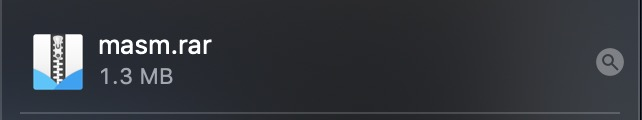
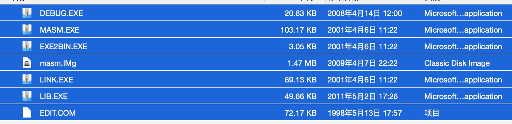
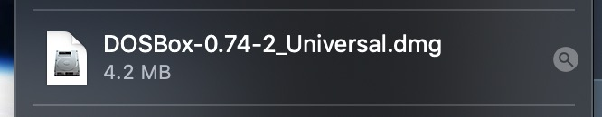
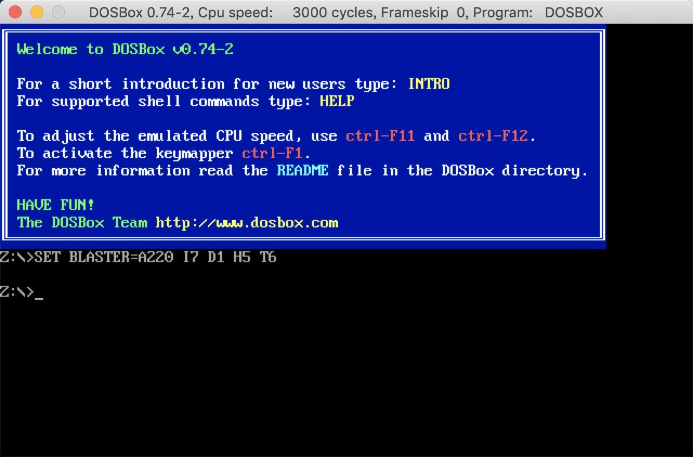
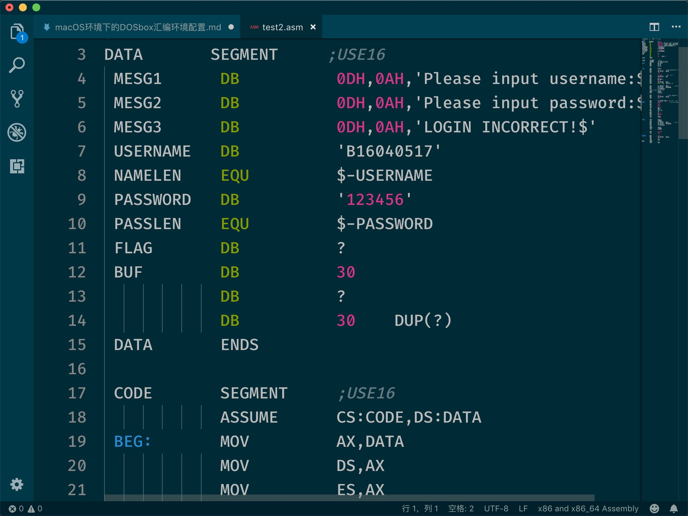
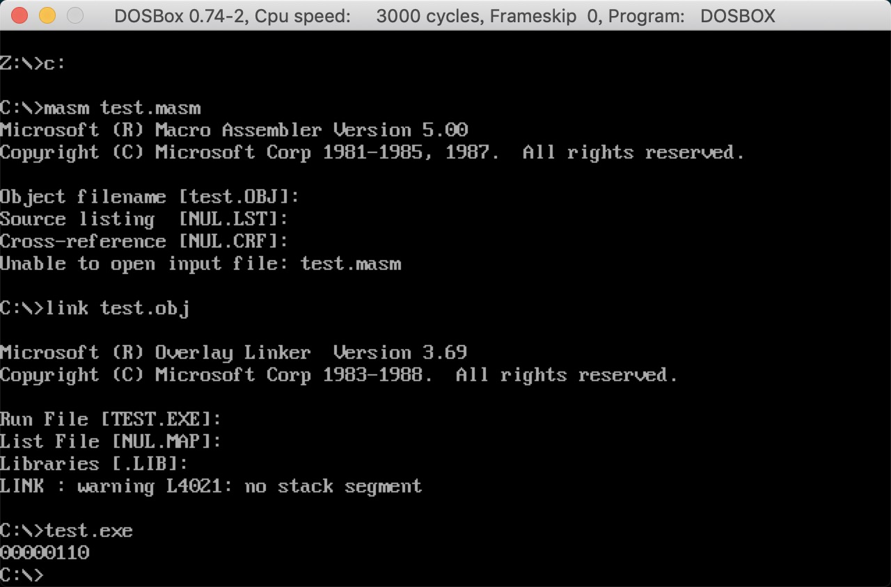

**Content**
[TOC]

### 资源下载
* [DOSBox for mac](https://www.dosbox.com/download.php?main=1)
* 汇编开发工具 [masm](http://www.masm32.com/download.htm)

(ps:我这里使用的是masm，但是其实tasm等等也都是可以的)

### 解压masm


1. 创建一个文件夹存放开发相关的文件
```
cd ~
mkdir MYDOSbox
```
2. 将解压的masm里面的文件全部粘贴到MYDOSbox


### 安装DOSBox
点击下载到的DOSBox的dmg进行安装。


### 打开安装的DOSBox


将c盘挂载到MYDOSbox目录下
```
mount c ~/MYDOSbox  // 挂载
c:   //进入c盘
```
然后就可以在里面进行汇编的基本开发步骤：
`编辑->编译->链接->调试->运行`
其中的编辑可以使用任何你喜欢的编辑器，比如这里我选择VScode

一段测试代码：

```
masm test.msa //编译
link test.obj //链接
test.exe // 运行
```

