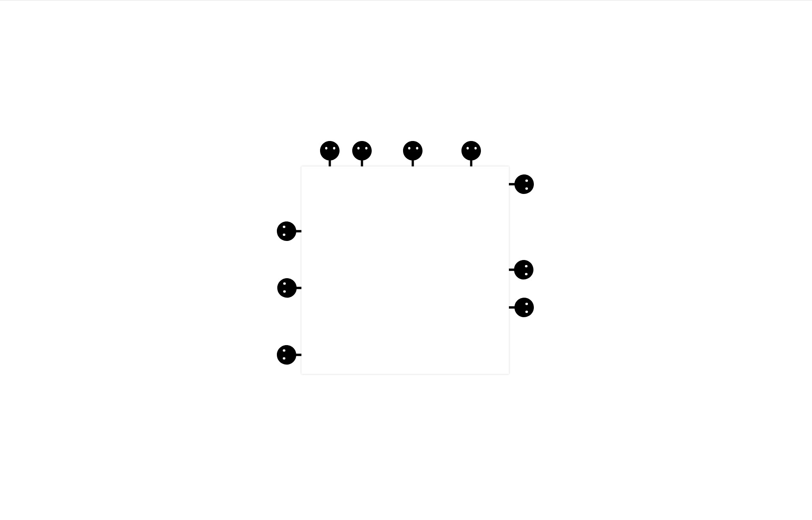
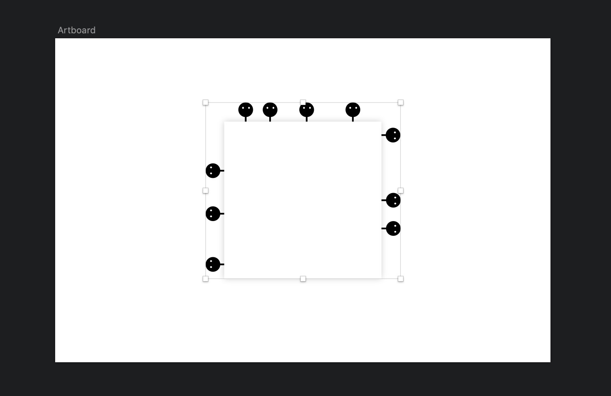

### 预览

### 在线demo
[Dome在这](https://codepen.io/De-Coder/pen/xQVBwG)
由于兼容性的问题还没解决，建议**Chrome**打开
### 灵感来源
某天在观看TED演讲[High-tech art (with a sense of humor)](https://www.ted.com/talks/aparna_rao_high_tech_art_with_a_sense_of_humor/discussion#t-13221)的时候看到里面的一个项目叫做**pygmies**，中文名叫**俾格米人**（图中的小黑人）。他们都很胆小，只要有声音就会被吓到躲到板子后面。
该项目的实物是由来自印度的团队制作的。测试中，俾格米人表现得惟妙惟肖，就像是一群好奇而又胆小的小动物。十分可爱!
于是我想用web技术似乎也能达到同样的效果。只需要浏览器调用麦克风，获取数据，作用于svg元素(当然这是最初的简单想法)。

### 准备svg素材
作图工具,Mac平台**sketch**


### 主要代码

html部分
```
// 主要是svg代码，量比较大，请在源码中查看
```

css部分
```
// 主要是基本的定位代码，请在源码中查看
```

js部分
```
"use strict";

var ctx, analyser, frequencies, getByteFrequencyDataAverage, draw;

// 兼容性
window.AudioContext = window.AudioContext || window.webkitAudioContext;
// 获取音频上下文
ctx = new window.AudioContext();

// 用户获取stream当中的时间、频率信息
analyser = ctx.createAnalyser();
frequencies = new Uint8Array(analyser.frequencyBinCount);
getByteFrequencyDataAverage = function() {
  // 将当前频域数据拷贝进数组
  analyser.getByteFrequencyData(frequencies);
  // 求得频域的平均值
  return (
    frequencies.reduce(function(previous, current) {
      return previous + current;
    }) / analyser.frequencyBinCount
  );
};

// 返回 Promise 对象
navigator.mediaDevices
  .getUserMedia({ audio: true })
  .then(function(stream) {
    // window.hackForMozzila = stream;
    ctx
      .createMediaStreamSource(stream)
      // 连接到AnalyserNode
      .connect(analyser);
  })
  .catch(function(err) {
    console.log(err.message);
  });

var pygmies = [];
for (let i = 0; i < 10; i++) {
  pygmies.push(document.getElementById(`pygmie-${i + 1}`));
}

// 改变小人的位置
(draw = function() {
  var moveValue = getByteFrequencyDataAverage() * 10;
  if (moveValue >= 35) {
    moveValue = 35;
  }
  pygmies[0].style.transform = `translate(51.000000px, ${moveValue}px)`;
  console.log(getByteFrequencyDataAverage());
  pygmies[1].style.transform = `translate(89.000000px, ${0.0 + moveValue}px)`;
  pygmies[2].style.transform = `translate(149.000000px, ${0.0 + moveValue}px)`;
  pygmies[3].style.transform = `translate(218.000000px, ${0.0 + moveValue}px)`;
  pygmies[4].style.transform = `translate(286.500000px, 51.000000px) rotate(90.000000deg) translate(-286.500000px, -51.000000px) translate(275.000000px, ${34.0 +
    moveValue}px)`;
  pygmies[5].style.transform = `translate(286.500000px, 152.000000px) rotate(90.000000deg) translate(-286.500000px, -152.000000px) translate(275.000000px, ${135.5 +
    moveValue}px)`;
  pygmies[6].style.transform = `translate(286.500000px, 196.5000000px) rotate(90.000000deg) translate(-286.500000px, -196.500000px) translate(275.000000px, ${179.5 +
    moveValue}px)`;
  pygmies[7].style.transform = `translate(17.500000px, 173.500000px) rotate(-90.000000deg) translate(-17.00000px, -173.500000px) translate(5.500000px, ${156.5 +
    moveValue}px)`;
  pygmies[8].style.transform = `translate(17.000000px, 106.500000px) rotate(-90.000000deg) translate(-17.00000px, -106.500000px) translate(5.500000px, ${89.5 +
    moveValue}px)`;
  pygmies[9].style.transform = `translate(17.00000px, 252.500000px) rotate(-90.000000deg) translate(-17.00000px, -252.500000px) translate(5.500000px, ${235.5 +
    moveValue}px)`;
  requestAnimationFrame(draw);
})();

```
代码主要是做了两件事：
* 获取麦克风的音频信息
* 利用音频信息改变svg的位置信息

只不过需要不断的循环，来获取最新的信息。


### 待优化部分

* 手动的修改每个俾格米人的位置真的很烦人；
* 通过修改transform参数来调节俾格米人的位置，很容易出错；
* 当俾格米人数量再多一点儿的时候，svg可能有性能缺陷；
* 俾格米人并不唯妙唯俏，离原版的生动程度还差很远；
这一部分需要去考虑生物的应激性特征、分不同情况、动画曲线等方面。达到赋予每个俾格米人不同的性格特征的效果（有的胆小，有的胆大，有的好奇心强等等）。
* 兼容性问题；
* ...

### 参考
> [TED](https://www.ted.com/talks/aparna_rao_high_tech_art_with_a_sense_of_humor/discussion#t-13221)
> [Web Audio API](https://developer.mozilla.org/zh-CN/docs/Web/API/Web_Audio_API#浏览器兼容性)
> [画随音动！Web Audio API 入门](https://juejin.im/entry/58b3e032ac502e006ca9db51)