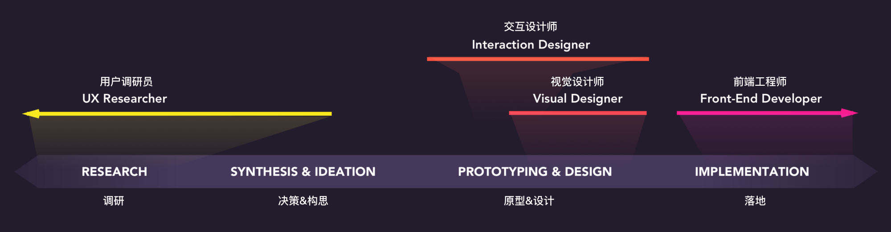
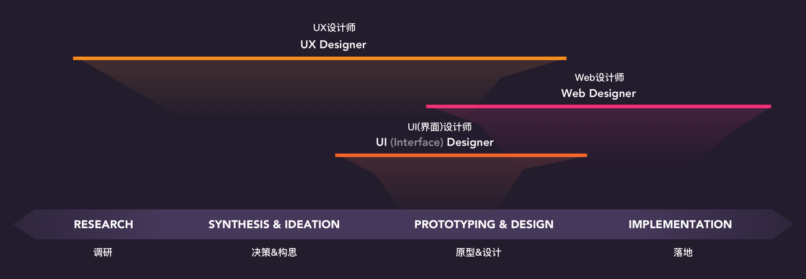
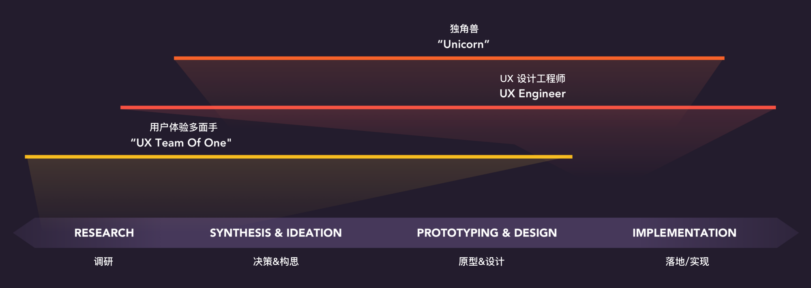
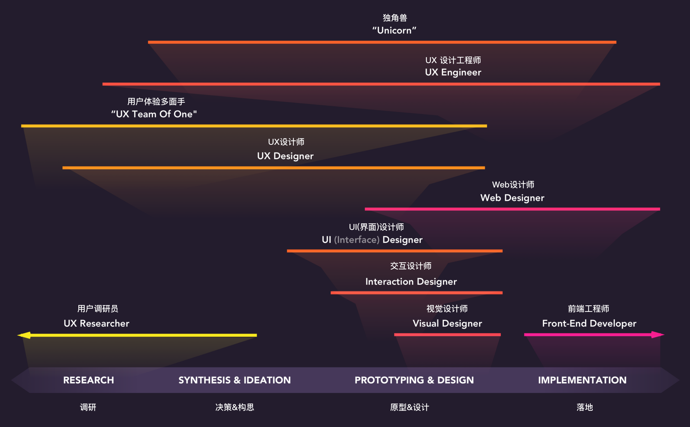

> 原文: [The spectrum of design roles in 2018](https://uxdesign.cc/the-spectrum-of-digital-design-roles-in-2018-3286390a9966)

#### 1. 单一焦点的设计角色

#### 2. 跨学科的设计角色

#### 3. 全栈的设计角色

#### 4. 总的来看

> 四张图让我清楚的知道
1. 自己在哪
2. 自己想去哪
3. 整个行业的角色分布是什么