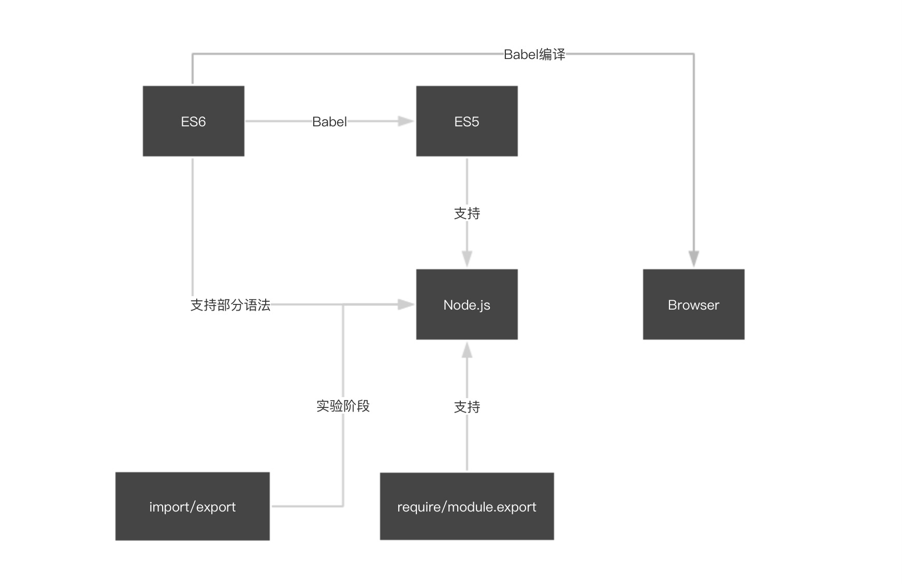

前端发展迅速，其中也包括javascript的语法变化（应该说是一种进步）。于是我，就在这样的环境下对其中的模块化写法的理解十分的混乱。
我至始至终没有明白这些`ES6 nodejs require export import...`它们之间到底是个什么样的关系。于是我被迫做了上面这张图来帮助我理解。
我知道，一段时间后我再来看它，它肯定是不准确的，甚至是错误的（或许目前也是错误的），但是对于帮助目前的我理解他们的关系还是很有用处的。

