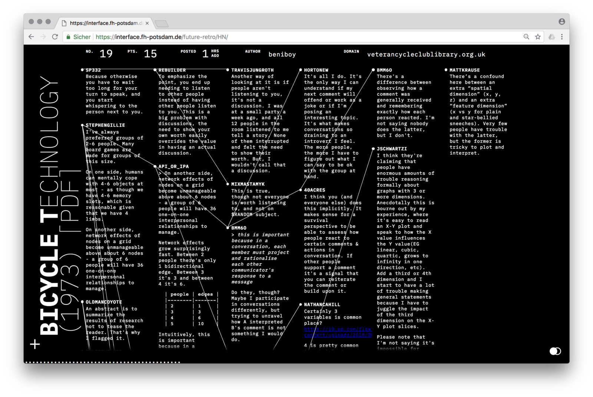

> 简短的回复关于文章“为什么所有的网页看起来都一样？”

上周，Medium上发表了我的名叫**为什么所有的网页看起来都一样？**的文章。这片文章最近得到了很多的关注。截止到我写这篇文章的时候我已经获得了55000次浏览量，27000阅读量，11300掌声和60个评论。我显然是个神经病。

不管怎么样，感谢大家的反馈！能够参与到一场热烈的讨论中是一件很好的事情！但是，我很难亲自回复每一份反馈。我收到了各种各样的反馈，反馈在推特和Medium上的评论非常的具有争议。没有过多的深入细节，许多的争论集中在“创意与实用性”这个热门的话题上来。

我的文章毫无疑问的收到了强烈的抨击。我指责了“模版网页趋势风格”，它阻碍了设计者创新并且挑战设计难题。但是我并没有指责实用性。这完全是曲解和扭曲我的文章观点。

关于“创意与实用性”的争辩已经持续了超过1000年。在这之前，相关话题已经触及到了科技发展和工业革命。历史证明为了在设计和科技中取得进步，创意与实用性都是非常重要的缺一不可。为了维持创意性和实用性的平衡，似乎我们必须一遍又一遍的讨论这个话题。在我的文章中，我想将自己的观点更多的偏向于创意性。

此外，我想明确在这次争辩中的几个特殊的观点。我写下了下面的几个部分作为第一个评论的回复。我仍然坚持我的观点，我认为这部分是一个很好的作为原文的补充。这篇回复[比较难找到](https://medium.com/@borism/hi-guys-thanks-for-you-feedback-here-are-a-couple-of-quick-comments-8308435f2c95)，所以我重新发布到这了。

### 1)框架模版应该为设计服务

框架是目前网页设计的一部分。一篇强烈抨击的文章是不会改变这一事实的。

框架非常的有用，它允许你快速发布并且使你能够非常便捷地将可靠的技术组合到一起，框架开发非常的高效。

但是我的想表达的是，现在的设计者趋向于将他们自己的创造力禁锢起来，以便来适应框架的设计。我一直坚信肯定存在其他的方式来进行这一过程。设计者和程序员应该思考如何创造框架来满足设计的需要，而不是一味的禁锢思维去适应框架。这就是我一直觉得设计者应该回自己编程实现想法的原因之一。如果你想突破界限，就必须要清楚它的局限性。

### 2)形式 ----> 内容

请允许我引用自己的话：

> One of the fundamental principles of design is a deep and meaningful connection between form and content; form should both reflect and shape content.
>
> （译：设计的一个基本原则是在内容和形式间建立一个深入的连接；形式应该充分的展现并且表示出内容的全部含义。）

换句话说，你需要用特定的设计方案去解决特定的设计问题。一种方案适合所有情况很少产生令人满意的结果。一个医院信息系统显然不适合用艺术排版。我不会请*David Carson*来设计小学课本教材。

但是现实生活中有很多除了医院和学校教材字体以外的需要设计的情况。有许多的应用场景，尤其是在文化、音乐、艺术领域。在这些应用场景中视觉设计起到的作用不仅仅是文字的可读性。这在印刷领域适用，在web设计中也不例外。

### 3)平装本网页

如果我们在网页设计和书本设计上做一个类比，其实目前的网页设计还处于**平装本网页**阶段。

平装书是一种小而便宜的消耗品。他们被用胶水粘贴在一起，用的是劣质的纸张，复印着低质量的图片和平庸的字体。但是不可否认的是它们在冗杂的市场中流动得很好，他们非常的高效廉价。

所以平装书没有任何问题。它们能够承载大部分的内容，甚至有许多设计很好的平装书。但是那些声称任何情况下都是平装书的行为真的太蠢了。因为事实上有很大的市场和需求是精装小说、摄影旅行期刊、高端的展览、精致的烹饪书等等。

没人希望所有的书都是平装书。但是在我目前的印象中，大多数人都将web网页视作平装书——它们是廉价、实用的信息承载物。这个位置忽略了这样一个事实，即网络是一个巨大的文化空间，即使是最小和最实用的网站也是一个人工制品。

这里有很多不同种类的书籍，从实用的平装书到专业的艺术书。我很期待看到这种文化和视觉多样性在web设计中蓬勃发展。

©️版权保护

原文作者[Boris Müller](https://medium.com/@borism?source=post_header_lockup)

[原文章连接](https://medium.com/@borism/balancing-creativity-and-usability-9bb2cd0fe929)