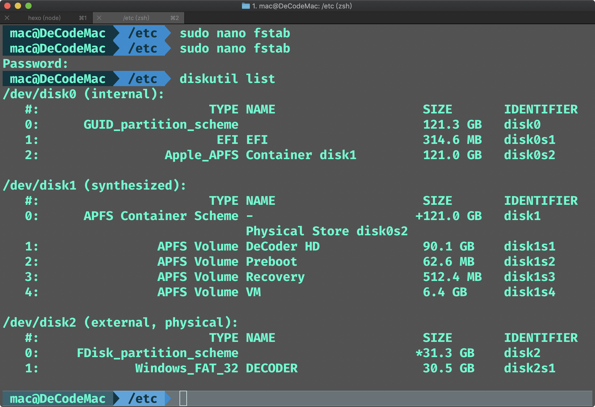
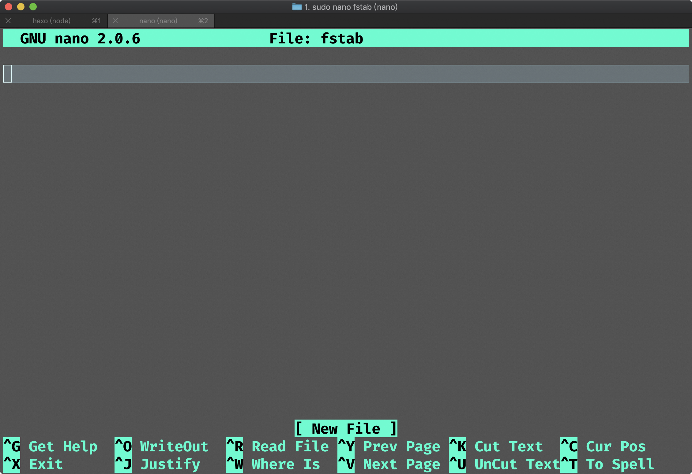
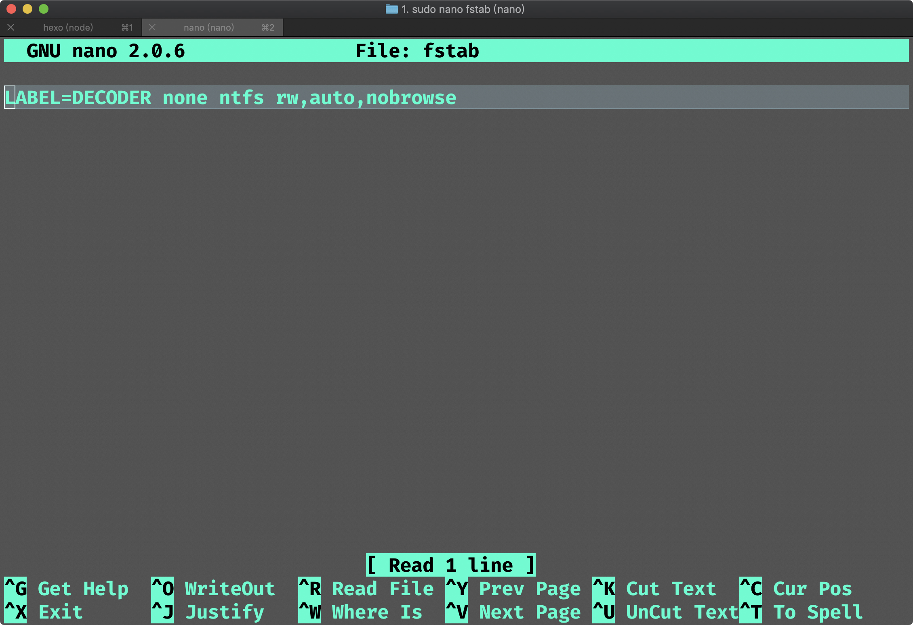
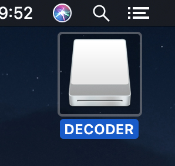

**Content**
[TOC]

### 问题
移动硬盘的文件格式在常用的win、macOS系统上并不完全的相互兼容，win用的是NTFS，就win来讲这种格式非常的好用。但是对于macOS来讲，NTFS格式的移动硬盘只能**读**不能**写**。对于常常用一个硬盘在两个平台同时使用的人来说，非常的不方便。

如果你传输的文件比较小（比如<4GB）可以将硬盘格式化为**FAT32**，这是一种兼容性非常好的文件格式，缺点就是单个文件大小不能超过**4GB**。

事实上macOS原生是自带NTFS写的能力的，只是在默认情况下是屏蔽掉的。

### 开启macOS的原生写NTFS能力
#### 1. 插上移动硬盘、打开终端(聚焦搜索*terminal*)
```
diskutil list
```
下面列出了电脑上的磁盘信息，找到移动硬盘的Volumn Name，我这里的叫**DECODER**

#### 2. 更新 /etc/fstab文件
```
sodu nano /etc/fstab
```
由于使用了超级用户权限sudo，所以提示需要输入密码,输入密码后:

然后输入:
```
LABEL=DECODER none ntfs rw,auto,nobrowse
```

这里的DECODER是我的移动硬盘的名称，这里替换成你自己的。然后按`ctrl+x`然后选择`y`保存，`enter`确认退出。最后重启电脑。
#### 3. 显示磁盘在finder
电脑重启后在finder/桌面都不现实硬盘，需要连链接一个快捷方式到桌面。
```
sudo ln -s /Volumns/DECODER ~/Desktop/DECODER
```
然后桌面就出现了那个你熟悉的硬盘图标。



