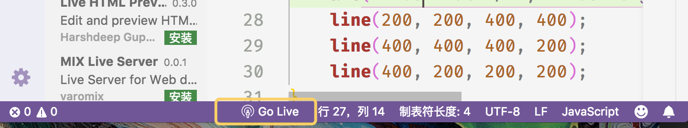
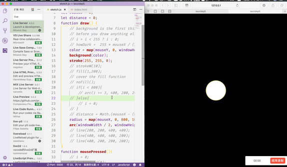

**Content**
[TOC]

在进行前端页面的实现时(不包括在线编辑器)，为了查看当前的实现效果，我们经常会采取的一个操作是

`IDE快捷键保存-->切换到浏览器-->浏览器快捷键刷新->看到最终的当前效果`

其实吧，我觉得也没那么麻烦。习惯了这一顿操作感觉也还好，然而，我觉得我就是习惯不了。重复的手动刷新让我烦躁。

网上其实也有相关的教程，我几乎试了一遍，发现有的不太管用。无意间在学习p5.js的时候看了youtube某大神的视频，学习到了如何正确的配置达到**保存修改文件自动刷新**的效果。

**这个极其简短的文章仅仅以macOS的vscode作为例子**，其他的平台和编辑器同理。

### 第1步，安装vscode插件

### 第2步，打开需要监听的html页面，点击下方的 `Go Live`

默认是在5500端口启动，当然你可以通过配置文件更改它。

### 第3步，修改当前文件，测试

不出意外你能看到这种效果。

`注释一行代码->保存->自动刷新->取消注释->保存->自动刷新`

现在我们将

`IDE快捷键保存-->切换到浏览器-->浏览器快捷键刷新->看到最终的当前效果`

这一常用的步骤简化为

`IDE快捷键保存-->看到最终的当前效果`

这这就很nice了啊:P

